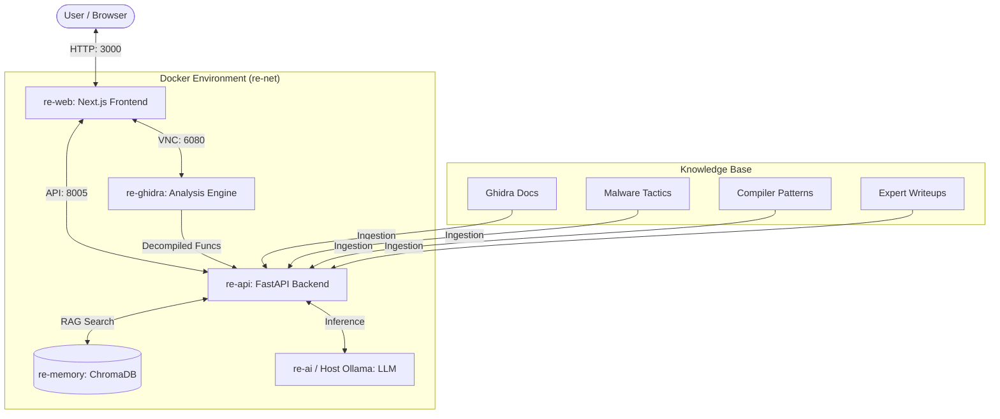

# reAIghidra

**AI-Powered Reverse Engineering Environment**

A containerized, multi-modal RAG system that integrates Ghidra with specialized AI knowledge streams to assist in binary analysis and malware reverse engineering.

## 🧠 Architecture

reAIghidra consists of 5 Docker containers:



1. **re-web**: Next.js frontend with VNC integration
2. **re-api**: FastAPI backend with RAG search engine
3. **re-ghidra**: Ghidra analysis environment with VNC access
4. **re-ai**: Ollama LLM inference (GPU-accelerated)
5. **re-memory**: ChromaDB vector database

## 🎯 Features

### Knowledge Graph RAG
- **Ghidra API Documentation**: Web-scraped docs and PDFs from ghidra.re
- **Compiler Patterns**: C/Assembly pairs for recognizing optimizations
- **Malware Tactics**: MITRE ATT&CK and Malpedia integration
- **Expert Knowledge**: CTF writeups and instruction manuals

### Reciprocal Rank Fusion (RRF)
Multi-stream search that combines results from all knowledge sources to provide comprehensive answers.

### Secure Binary Analysis
All binaries are analyzed within the `re-ghidra` container - no execution on the host system.

## 🚀 Quick Start

### Prerequisites
- Docker Desktop with GPU support
- 16GB+ VRAM recommended
- Git

### Setup

1. **Clone the repository**
```bash
git clone https://github.com/Sagz9000/re_brain.git
cd re_brain
```

2. **Pull the LLM model**
```bash
docker run --rm -v ollama-data:/root/.ollama ollama/ollama pull qwen2.5:7b
```

3. **Start the stack**
```bash
docker-compose up -d
```

**Alternative: Using Host Ollama**

If you already have Ollama running on your host machine:

```bash
# Use the host-ollama configuration
docker-compose -f docker-compose.host-ollama.yml up -d
```

This configuration:
- Removes the `re-ai` container
- Connects to `host.docker.internal:11434` (your host Ollama)
- Reduces resource usage and startup time

4. **Access the UI**
Open `http://localhost:3000` in your browser.

## 📊 Usage

### Analyzing a Binary

1. Upload your binary to `data/binaries/`
2. Open Ghidra via the VNC interface (left panel)
3. Load your binary in Ghidra
4. Run the `AnalyzeAndIngest.py` script from `Tools > AI > Analyze and Ingest`
5. Ask questions in the AI chat panel (right side)

### Ingesting Knowledge Sources

```bash
# Enter the backend container
docker exec -it re-api bash

# Run the knowledge manager
python -c "from knowledge_base import KnowledgeManager; KnowledgeManager().ingest_all()"
```

## 🛠️ Project Structure

```
reAIghidra/
├── backend/              # FastAPI + RAG logic
│   ├── knowledge_base/   # Ingestion pipelines
│   ├── search_engine.py  # RRF implementation
│   └── main.py           # API endpoints
├── web/                  # Next.js frontend
│   └── app/              # Pages and components
├── ghidra_scripts/       # Ghidra automation scripts
├── data/                 # Knowledge sources (gitignored)
└── docker-compose.yml    # Service orchestration
```

## 🔧 Configuration

### GPU Settings
Edit `docker-compose.yml` to adjust GPU allocation for the `re-ai` service.

### Model Selection
Change the model in `backend/main.py` or via the API request body.

## 📝 License

MIT

## 🙏 Acknowledgments

- Ghidra by NSA
- Ollama for local LLM inference
- ChromaDB for vector storage
