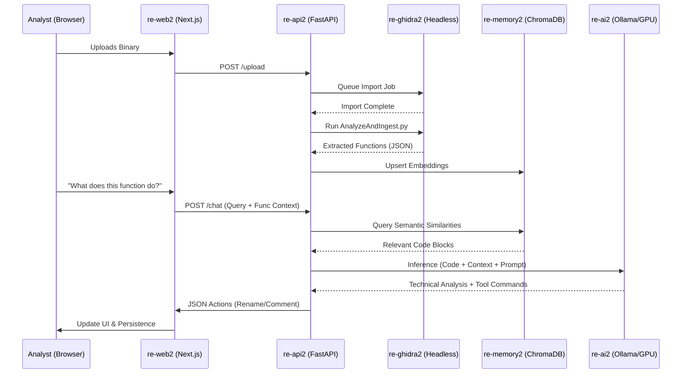
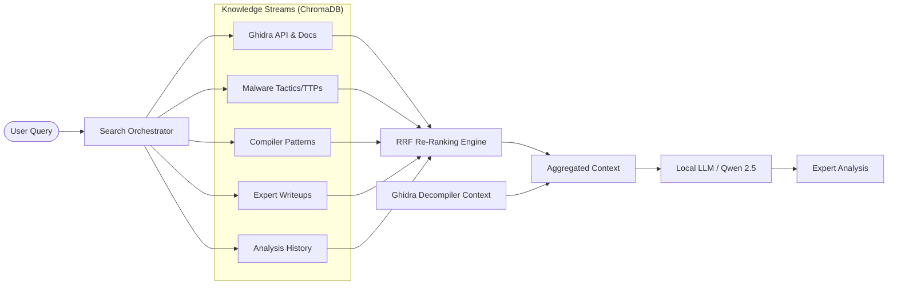

# re-Brain: AI-Augmented Binary Analysis Ecosystem 🧠🛡️

**re-Brain** is a professional-grade, multi-modal reverse engineering platform that synthesizes the precision of **Ghidra** with the reasoning power of **Local Large Language Models (LLMs)**. Designed for the modern malware researcher, it implements a highly optimized **Retrieval-Augmented Generation (RAG)** pipeline to bridge the gap between static disassembly and high-level AI analysis.

### 📽️ Analysis Workflow Demonstration
Watch re-Brain in action as it disassembles a target, identifies core logic, and uses AI context to solve a reverse engineering challenge.

<video src="https://github.com/Sagz9000/re_brain/raw/main/pictures/simplecrack.mp4" width="600" controls></video>

---

## 🏛️ 1. Technical Architecture & System Design

re-Brain adheres to a distributed micro-service architecture, ensuring that heavy computational tasks (Ghidra analysis) and intensive inference (LLM) operate in isolation to maximize stability and performance.

### 🔄 1.1 Data & Process Orchestration
The **re-api2** "Brain" container acts as the central hub, orchestrating the flow between the VNC-enabled analysis engine, the vector memory, and the local inference node.

### 🧠 1.2 RAG Architecture: Reciprocal Rank Fusion (RRF)
re-Brain implements a custom **Multi-Source RAG** strategy that uses **Reciprocal Rank Fusion (RRF)** to synthesize intelligence from five distinct knowledge streams. This ensures the LLM receives the most relevant context regardless of which database contains the answer.

**Why RRF?**  
Standard vector search can be biased towards a single database's embedding space. RRF calculates a consolidated score using `1 / (k + rank)`, naturally promoting results that are "universally" relevant across multiple expert domains.

---

## �️ 2. UI Walkthrough & Component Guide

The re-Brain interface is a highly customizable, window-based environment designed for complex forensic tasks.

### 2.1 Workspace Overview
Observe the clean, transparent-blended desktop. All components are **floating windows** that can be moved, resized, or grouped.

### 2.2 Component Directory
- **🐚 AI Docked Chat**: Your primary interface with the "Brain." It features reasoning transparency (Show/Hide Reasoning), inline link rendering for addresses/functions, and a direct Python execution console.
- **🌳 Symbol Tree**: A fully searchable index of all functions, imports, exports, and labels discovered during analysis. It supports real-time filtering to locate specific logic instantly.
- **📜 Decompiler View**: High-fidelity C-style translation of assembly. Integrated with the AI, it allows for one-click navigation and synchronization with the AI's analysis.
- **🔢 Hex Viewer**: A precision byte viewer for low-level inspection. It supports "Goto" synchronization, automatically jumping to addresses mentioned in the AI chat.
- **🧵 Strings Viewer**: Extracts and indexes all strings. Crucially, it provides the **Hexadecimal Memory Offset** for every string, allowing for immediate cross-referencing in the Hex or Decompiler views.
- **🖥️ Ghidra VNC**: For tasks requiring standard Ghidra GUI interaction, a full instance is accessible via an embedded noVNC window, sharing the same project state as the AI.

---

## 🐍 3. Feature Highlight: Python Execution
Integrated directly into the chat interface, re-Brain enables on-the-fly Python script execution. Researchers can perform rapid data manipulation, decoding (Base64/XOR), or custom hash calculations without leaving the research environment.

<video src="https://github.com/Sagz9000/re_brain/raw/main/pictures/runpythoncode.mp4" width="600" controls></video>

---

## �️ 4. Advanced Component technicals

### 4.1 re-api2: The Orchestration Brain
Manages the complex interactions between Ghidra scripts and AI inference.
- **Integrated Subprocess Management**: Handles headless Ghidra execution with project locking.
- **Prompt Engineering**: Dynamically constructs context-rich prompts including decompiled code, function signatures, and RAG-retrieved neighbors.

### 4.2 re-ai2: Local Inference Node
A high-performance inference server that runs completely locally, ensuring your sensitive binaries are never transmitted to third-party APIs. Supporting **NVIDIA GPU Acceleration**.

---

## ⚡ 5. Deployment Guide

1.  **Build the Infrastructure**: `docker-compose up --build -d`
2.  **Verify Health**: Check `http://localhost:8005/health`
3.  **Bootstrap Models**: The system will automatically pull `qwen2.5-coder:14b`.

---
*Designed for the elite reverse engineering community. re-Brain 2026.*
