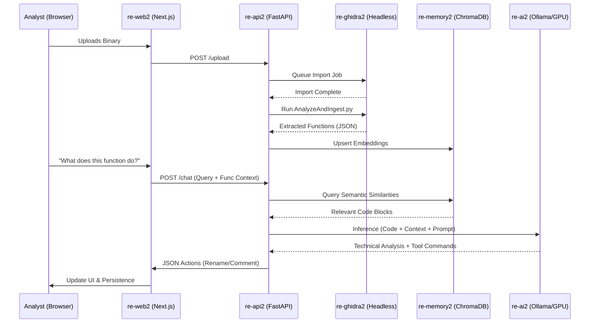
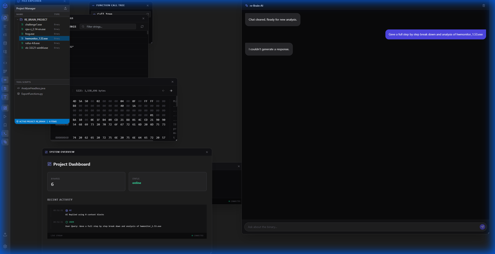
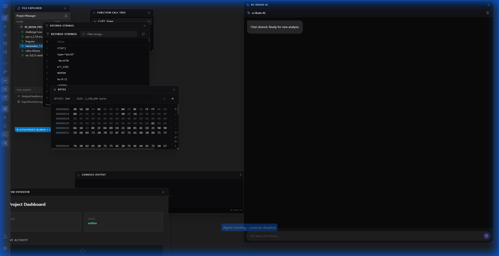
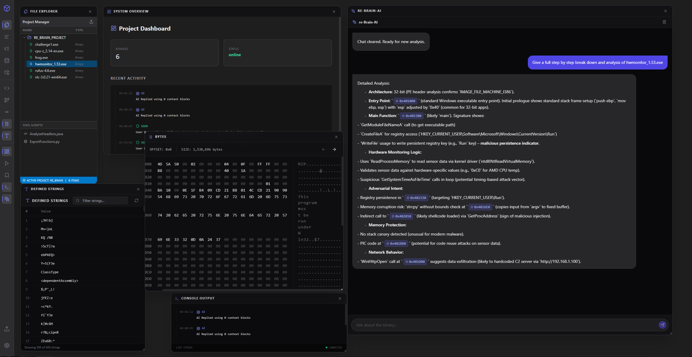

# re-Brain: AI-Augmented Binary Analysis Ecosystem 🧠🛡️

**re-Brain** is a professional-grade, multi-modal reverse engineering platform that synthesizes the precision of **Ghidra** with the reasoning power of **Local Large Language Models (LLMs)**.

### 📽️ Feature Highlight: Python Execution
Integrated directly into the chat, you can execute arbitrary Python scripts to aid analysis. Use it for XORing a buffer, calculating a custom hash, or parsing an proprietary struct.

<video src="https://github.com/Sagz9000/re_brain/raw/main/pictures/runpythoncode.mp4" width="600" controls></video>

---

## 🏛️ 1. Technical Architecture & System Design

re-Brain adheres to a distributed micro-container architecture, ensuring that heavy computational tasks (Ghidra analysis) and intensive inference (LLM) do not bottleneck the user experience.

### 🔄 Data & Process Orchestration
The system revolves around the **re-api2** "Brain" container, which acts as a central hub for all communications.



### 📦 Component Breakdown

#### **1.1 Frontend: The Digital Cockpit (`re-web2`)**
*   **Framework**: Next.js 14 (App Router) with TypeScript.
*   **State Management**: Real-time React state hooks for window management and AI link interaction.
*   **UI/UX**: Custom workspace with **floating, groupable windows**. 
*   **VNC Integration**: Low-latency embedding of the Ghidra GUI via noVNC (Port 6080).

#### **1.2 Backend: The Logical Core (`re-api2`)**
*   **Engine**: FastAPI (Python 3.10+).
*   **Ghidra Interfacing**: Uses `subprocess` to trigger `analyzeHeadless`.
*   **Concurrency Control**: Implements a `ghidra_lock` (Threading Lock) to prevent project corruption during simultaneous analysis tasks.

---

## 🚀 2. Feature Deep-Dive

### 🤖 The AI Analysis Pipeline
Unlike generic LLM chats, re-Brain passes the **Current Program Counter (PC)** and **Decompiled Function** context into every prompt.



#### **Advanced Tool Calling (Action Schema)**
The AI can emit structured JSON commands that the frontend automatically intercepts and executes:
| Action | Description | Result |
| :--- | :--- | :--- |
| `rename` | Changes function/variable names | GHIDRA PRJ Update |
| `comment` | Adds Decompiler/Plate comments | GHIDRA DB Sync |
| `goto` | Navigates the entire UI to an address | Cross-Window Sync |

### 🔍 Binary Forensic Suite

#### **Symbol Tree & Semantic Search**
Deep indexing allows for instantaneous searching through thousands of functions. The Symbol Tree tracks:
- **Imports/Exports**: Direct links to DLL/SO dependencies.
- **Labels**: User-defined and Ghidra-inferred markers.

#### **Strings Analysis (with Memory Mapping)**
The **Strings Viewer** captures every sequence of characters, mapping them to their exact hexadecimal offset. This is critical for identifying obfuscated strings or data references.

#### **Workflow Demonstration**
Watch re-Brain in action as it disassembles a target, identifies core logic, and uses AI context to solve a reverse engineering challenge.

<video src="https://github.com/Sagz9000/re_brain/raw/main/pictures/simplecrack.mp4" width="600" controls></video>

---

### 📷 Desktop Environment & AI Context
Observe the clean desktop feel of the application and how the AI interacts within the workspace.




---

## ⚡ 3. Deployment Guide

### **Prerequisites**
- **NVIDIA Container Toolkit** (for GPU acceleration).
- **Docker Compose v2.x**.

### **Installation**
1.  **Build the Stack**:
    ```bash
    docker-compose up --build -d
    ```
2.  **Verify Services**:
    Check `http://localhost:8005/health` to ensure the Brain is online.
3.  **Bootstrap AI**:
    The system will automatically attempt to pull the required models. Monitor `docker logs re-ai2` for progress.

---

*Designed for the elite reverse engineering community. re-Brain 2026.*
