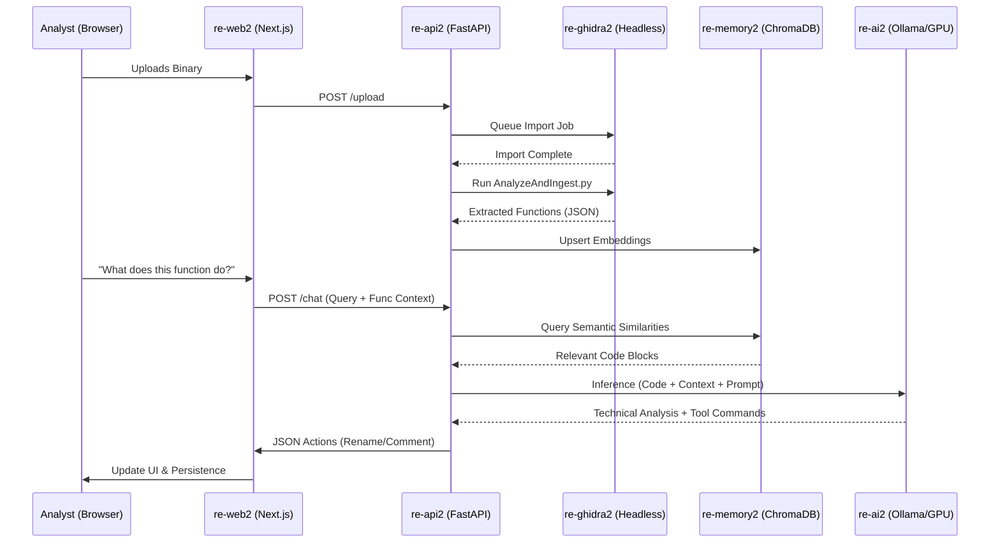

# re-Brain: AI-Augmented Binary Analysis Ecosystem 🧠🛡️

**re-Brain** is a professional-grade, multi-modal reverse engineering platform that synthesizes the precision of **Ghidra** with the reasoning power of **Local Large Language Models (LLMs)**. Designed for the modern malware researcher, it implements a highly optimized **Retrieval-Augmented Generation (RAG)** pipeline to bridge the gap between static disassembly and high-level AI analysis.

### 📽️ Analysis Workflow Demonstration
Watch re-Brain in action as it disassembles a target, identifies core logic, and uses AI context to solve a reverse engineering challenge.

<video src="https://github.com/Sagz9000/re_brain/raw/main/pictures/simplecrack.mp4" width="600" controls></video>

[](https://youtu.be/Ihdp65vhp9k)

---

## 🏛️ 1. Technical Architecture & System Design

re-Brain adheres to a distributed micro-service architecture, ensuring that heavy computational tasks (Ghidra analysis) and intensive inference (LLM) operate in isolation to maximize stability and performance.

### 🔄 Data & Process Orchestration
The **re-api2** "Brain" container acts as the central hub, orchestrating the flow between the VNC-enabled analysis engine, the vector memory, and the local inference node.



### 🧠 1.1 RAG Implementation: Reciprocal Rank Fusion (RRF)
re-Brain uses a sophisticated **Multi-Stream RAG** strategy powered by **Reciprocal Rank Fusion (RRF)**. This allows the system to aggregate and prioritize intelligence from disparate sources:

*   **Multi-Source Indexing**: The engine simultaneously queries collections for Ghidra Documentation, Malware Tactics, Compiler Patterns, Expert Writeups, and previously analyzed Binary Functions.
*   **Rank Fusion**: Unlike simple similarity searches, RRF calculates a consolidated score using the formula `score = sum(1 / (k + rank))`, where `k=60`. This ensures that documents appearing high in *any* of the specialized knowledge streams are prioritized for the LLM's context.
*   **Semantic Context**: This RRF-ranked context allows the AI to perform "analogical reasoning," identifying malicious traits by comparing your current function against global malware tactical patterns.

---

## 📦 2. Component Deep-Dive

### 2.1 re-web2: The Modern Analyst Cockpit
The frontend provides a state-of-the-art workspace inspired by high-end IDEs and terminal environments.
- **Technology**: Next.js 14, Tailwind CSS, Lucide Icons, and custom glassmorphic UI tokens.
- **Port**: `3000` (HTTP access).
- **Core Features**:
    - **Floating Window Manager**: Rearrange Decompiler, Hex Viewer, and Symbol Tree windows to fit your workflow.
    - **Contextual Chat**: A persistent AI analyst with breadcrumb navigation back to code addresses.
    - **Real-time Interaction**: Clickable function links and memory addresses that synchronize across all open viewers.

### 2.2 re-api2: The Orchestration Brain
This container manages the complex interactions between Ghidra scripts and AI inference.
- **Technology**: FastAPI (Python 3.10+), integrated Subprocess management.
- **Port**: `8005` (Host mapping to 8000 internally).
- **Responsibilities**:
    - **RAG Orchestration**: Executes the RRF search engine to compile multi-source context.
    - **Python Runtime**: Implements the `POST /run` endpoint for the chat-integrated Python console.
    - **Concurrency**: Manages an internal threading lock to ensure project integrity during simultaneous analysis requests.

### 2.3 re-ghidra2: The Analysis Engine
The heavy lifter of the ecosystem, providing both headless script execution and full GUI access.
- **Technology**: customized Ghidra build with X11/VNC and noVNC support.
- **Ports**: `6080` (noVNC Browser Access), `5900` (Direct VNC).

---

## 🚀 3. Feature Deep-Dive

### 🤖 Intelligent AI Analyst
re-Brain's AI is deeply integrated with the binary state. It doesn't just "talk" about code; it understands the program counter and the stack.


#### **Advanced Tool Calling**
The AI can emit structured actions that the frontend executes on your behalf:
| Action | Description | Result |
| :--- | :--- | :--- |
| `rename` | Suggests meaningful names for stripped functions | GHIDRA DB Update |
| `comment` | Documents complex logic in the decompiler | Permanent Analyst Notes |
| `goto` | Synchronizes the UI to a specific memory offset | Global Window Movement |

### � Feature Highlight: Python Execution
Integrated directly into the chat interface, re-Brain enables on-the-fly Python script execution. Researchers can perform rapid data manipulation, decoding (Base64/XOR), or custom hash calculations without leaving the research environment.

<video src="https://github.com/Sagz9000/re_brain/raw/main/pictures/runpythoncode.mp4" width="600" controls></video>

[](https://youtu.be/wIv-ikj12NI)

---

### 📷 Desktop Environment & AI Context
Observe the clean desktop feel of the application and how the AI interacts within the workspace.


---

## ⚡ 4. Deployment Guide

### **Prerequisites**
- **NVIDIA Container Toolkit** (for GPU acceleration).
- Linux or WSL2 environment (for Docker networking compatibility).

### **Installation**
1.  **Build the Infrastructure**:
    ```bash
    docker-compose up --build -d
    ```
2.  **Verify Health**:
    Check `http://localhost:8005/health` to confirm the API is ready.
3.  **Bootstrap Models**:
    The system will automatically attempt to pull `qwen2.5-coder:14b`. Verify progress with `docker logs re-ai2`.

---
*Designed for the elite reverse engineering community. re-Brain 2026.*
