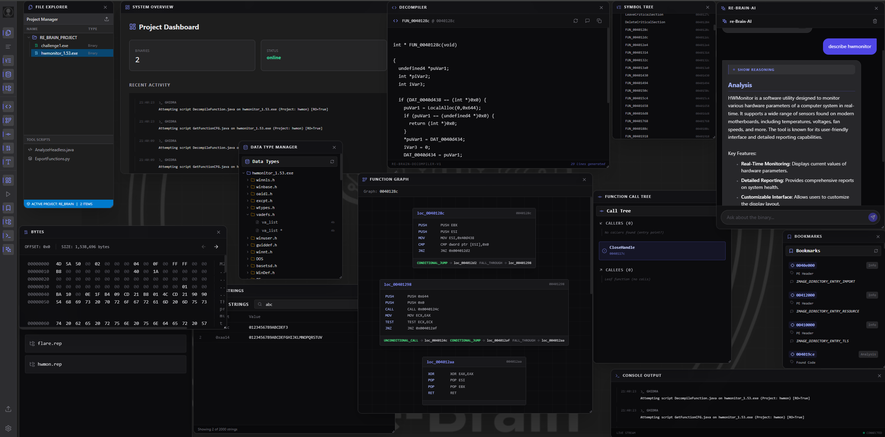
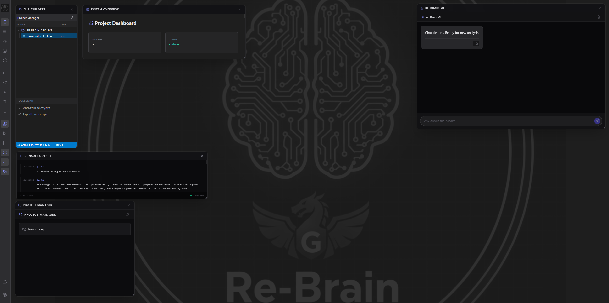
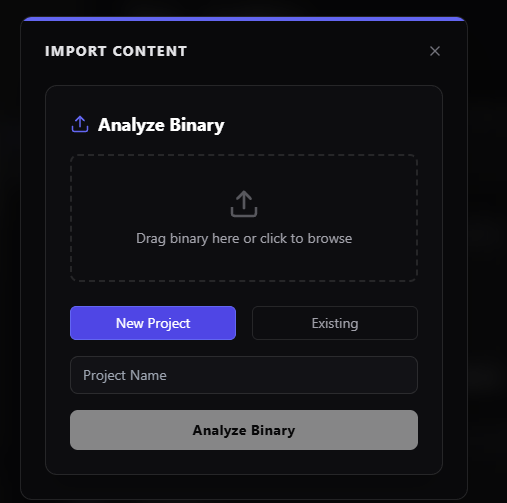
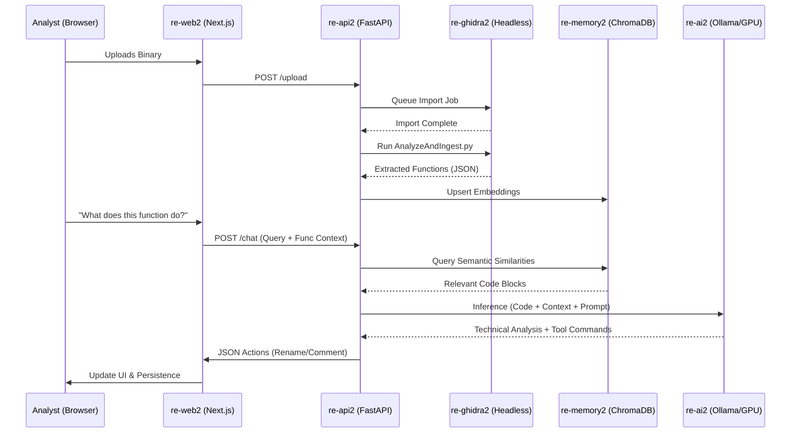
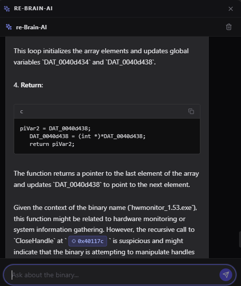
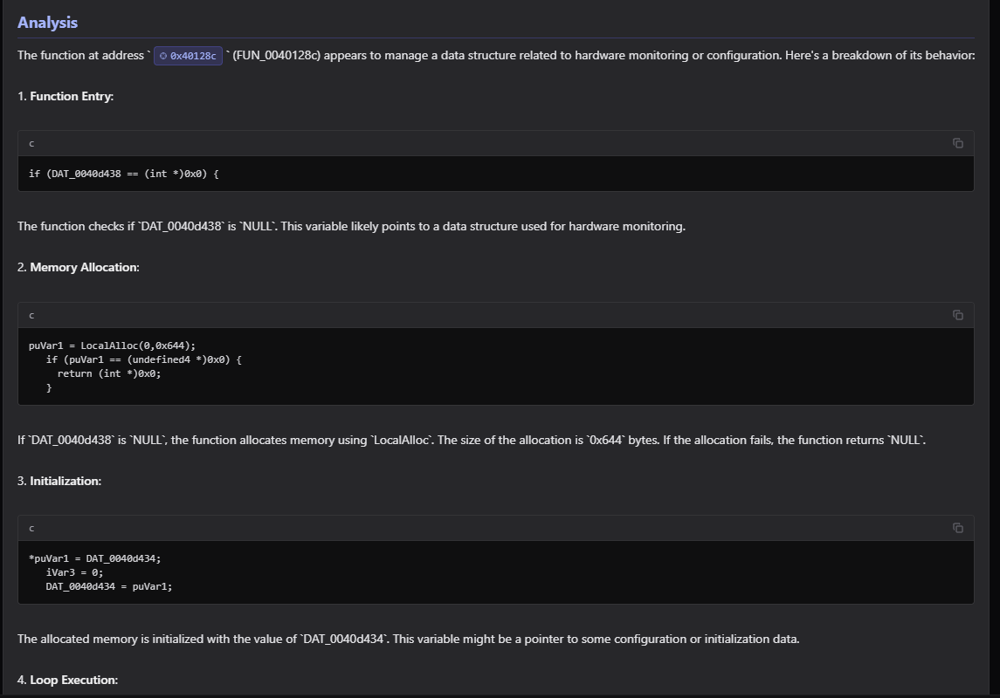
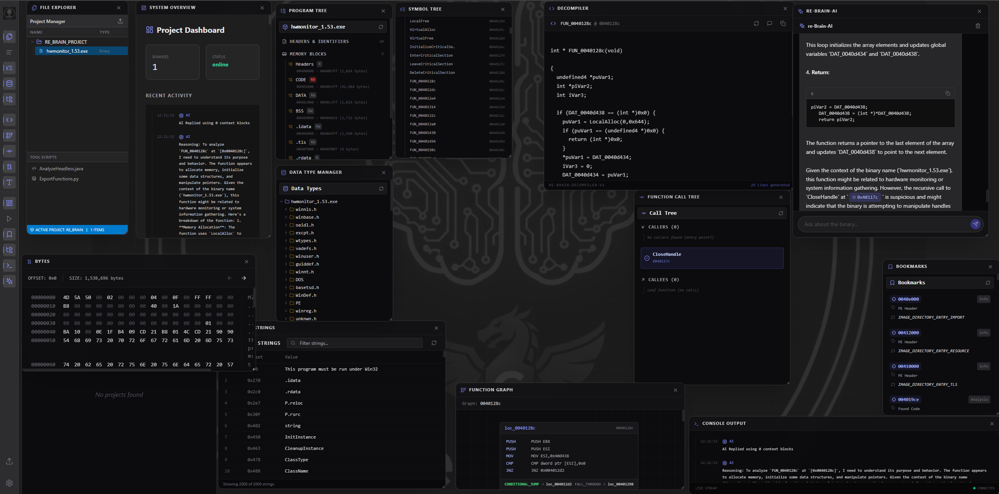

# re-Brain: AI-Augmented Binary Analysis Ecosystem 🧠🛡️

**re-Brain** is a professional-grade, multi-modal reverse engineering platform that synthesizes the precision of **Ghidra** with the reasoning power of **Local Large Language Models (LLMs)**. Designed for the modern malware researcher, it implements a highly optimized **Retrieval-Augmented Generation (RAG)** pipeline to bridge the gap between static disassembly and high-level AI analysis.

> [!NOTE]
> **re-Brain 2.0** was heavily influenced by and leverages core analysis concepts from [GhidraMCP](https://github.com/LaurieWired/GhidraMCP) by LaurieWired.

### � Workspace Overview

### �📽️ Analysis Workflow Demonstration
Watch re-Brain in action as it disassembles a target, identifies core logic, and uses AI context to solve a reverse engineering challenge.

<video src="https://github.com/Sagz9000/re_brain/raw/main/pictures/simplecrack.mp4" width="600" controls></video>

---

## 🏛️ 1. Technical Architecture & System Design

re-Brain adheres to a distributed micro-service architecture, ensuring that heavy computational tasks (Ghidra analysis) and intensive inference (LLM) operate in isolation to maximize stability and performance.

### �️ 1.1 Ingestion & Project Management

### �🔄 1.2 Data & Process Orchestration
The **re-api2** "Brain" container acts as the central hub, orchestrating the flow between the VNC-enabled analysis engine, the vector memory, and the local inference node.

### 🧠 1.3 RAG Architecture: Reciprocal Rank Fusion (RRF)
re-Brain implements a custom **Multi-Source RAG** strategy that uses **Reciprocal Rank Fusion (RRF)** to synthesize intelligence from five distinct knowledge streams. This ensures the LLM receives the most relevant context regardless of which database contains the answer.

**Why RRF?**  
Standard vector search can be biased towards a single database's embedding space. RRF calculates a consolidated score using `1 / (k + rank)`, naturally promoting results that are "universally" relevant across multiple expert domains.

---

## 🖥️ 2. UI Walkthrough & Component Guide

### 🧬 2.1 The "Floating UI" Design Philosophy
The re-Brain frontend reimagines the reverse engineering workspace as a **Dynamic Fluid Desktop**. Unlike traditional static tabs, re-Brain uses a reactive **Floating UI** architecture:
- **Zero Constraint Layout**: Every analysis module (Decompiler, Hex, Chat) exists as an independent, draggable entity.
- **Micro-App Orchestration**: Each window is its own isolated component that communicates via a global message bus, allowing for "Goto" and "Sync" actions to propagate instantly.
- **Glassmorphic Aesthetics**: A translucent, dark-themed interface ensures that background wallpaper and secondary windows remain subtly visible, maintaining spatial awareness during deep-dive analysis.

### 🧩 2.2 Component Directory & Functionality
| Component | Description | Deep-Link Integration |
| :--- | :--- | :--- |
| **🐚 AI Docked Chat** | The command center. Features real-time reasoning visualization and a direct Python execution runtime. | Intercepts `goto` and `rename` JSON payloads. |
| **🌳 Symbol Tree** | A hierarchical index of program structure. Supports fuzzy search and filtering for Functions, Imports, and Labels. | Syncs with Decompiler and Hex views on selection. |
| **📜 Decompiler** | C-style high-level representation of assembly logic. Augmented with AI-driven comments and automatic variable renaming. | Receives `comment` and `rename` updates from AI. |
| **🔢 Hex Viewer** | Precision memory inspector. Bridges the gap between raw data and high-level code. | Direct sync with `goto` commands. |
| **🧵 Strings Viewer** | Deep-indexes binary strings. Includes **Hexadecimal Memory Offsets** for every entry. | Clicking an offset triggers a global `goto` event. |
| **🖥️ Ghidra VNC** | A full-featured Ghidra GUI instance accessible via browser (noVNC). | Shared project state with the AI-powered headless backend. |

---

## � 3. Feature Deep-Dive

### 🤖 Intelligent AI Analyst
re-Brain's AI is deeply integrated with the binary state. It doesn't just "talk" about code; it understands the program counter and the stack.

#### **Advanced Tool Calling**
The AI can emit structured actions that the frontend executes on your behalf:
| Action | Description | Result |
| :--- | :--- | :--- |
| `rename` | Suggests meaningful names for stripped functions | GHIDRA DB Update |
| `comment` | Documents complex logic in the decompiler | Permanent Analyst Notes |
| `goto` | Synchronizes the UI to a specific memory offset | Global Window Movement |

### 🔍 Forensic Capabilities

### 🐍 Feature Highlight: Python Execution
Integrated directly into the chat interface, re-Brain enables on-the-fly Python script execution. Researchers can perform rapid data manipulation, decoding (Base64/XOR), or custom hash calculations without leaving the research environment.

<video src="https://github.com/Sagz9000/re_brain/raw/main/pictures/runpythoncode.mp4" width="600" controls></video>

---

## 🛠️ 4. Advanced Component Technicals

### 4.1 re-api2: The Orchestration Brain
Manages the complex interactions between Ghidra scripts and AI inference.
- **Integrated Subprocess Management**: Handles headless Ghidra execution with project locking.
- **Prompt Engineering**: Dynamically constructs context-rich prompts including decompiled code, function signatures, and RAG-retrieved neighbors.

### 4.2 re-ai2: Local Inference Node
A high-performance inference server that runs completely locally, ensuring your sensitive binaries are never transmitted to third-party APIs. Supporting **NVIDIA GPU Acceleration**.

---

## ⚡ 5. Deployment Guide

1.  **Build the Infrastructure**: `docker-compose up --build -d`
2.  **Verify Health**: Check `http://localhost:8005/health`
3.  **Bootstrap Models**: The system will automatically pull `qwen2.5-coder:14b`.

---

 re-Brain 2026.*
