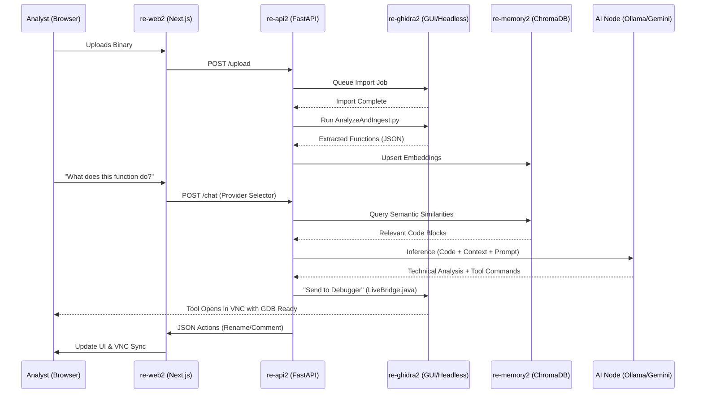

# re-Brain: AI-Augmented Binary Analysis Ecosystem 🧠🛡️

**re-Brain** is a professional-grade, multi-modal reverse engineering platform that synthesizes the precision of **Ghidra** with the reasoning power of **Local Large Language Models (LLMs)**. Designed for the modern malware researcher, it implements a highly optimized **Retrieval-Augmented Generation (RAG)** pipeline to bridge the gap between static disassembly and high-level AI analysis.

> [!NOTE]
> **re-Brain 2.0** is technically influenced by and adapts core logic from [GhidraMCP](https://github.com/LaurieWired/GhidraMCP) by LaurieWired. While the **Ghidra Analysis Scripts** (CFG, XRefs, Renaming) leverage the implementation patterns found in GhidraMCP, the **orchestration layer, JSON protocol, and full-stack integration** are custom-built for the re-Brain ecosystem.

## 📑 Table of Contents
- [re-Brain: AI-Augmented Binary Analysis Ecosystem](#re-brain-ai-augmented-binary-analysis-ecosystem-%EF%B8%8F)
  - [🪡 Workspace Overview](#%EF%B8%8F-workspace-overview)
  - [🎞️📽️ Analysis Workflow Demonstration](#%EF%B8%8F%EF%B8%8F-analysis-workflow-demonstration)
- [🏛️ 1. Technical Architecture & System Design](#%EF%B8%8F-1-technical-architecture--system-design)
  - [🦾 1.1 Ingestion & Project Management](#%EF%B8%8F-11-ingestion--project-management)
  - [🔄 1.2 Data & Process Orchestration](#%EF%B8%8F%EF%B8%8F-12-data--process-orchestration)
  - [🧠 1.3 RAG Architecture: Reciprocal Rank Fusion (RRF)](#-13-rag-architecture-reciprocal-rank-fusion-rrf)
- [🖥️ 2. UI Walkthrough & Component Guide](#%EF%B8%8F-2-ui-walkthrough--component-guide)
  - [🧬 2.1 The "Floating UI" Design Philosophy](#-21-the-floating-ui-design-philosophy)
  - [🧩 2.2 Component Directory & Functionality](#-22-component-directory--functionality)
- [🔍 3. Advanced Forensic Analysis Modules](#-3-advanced-forensic-analysis-modules)
  - [☣️ 3.1 Specialist Scans](#%EF%B8%8F-31-specialist-scans)
  - [🐍 Feature Highlight: Python Execution](#-feature-highlight-python-execution)
- [🛠️ 4. Advanced Component Technicals](#%EF%B8%8F-4-advanced-component-technicals)
  - [4.1 re-api2: The Orchestration Brain](#41-re-api2-the-orchestration-brain)
  - [4.2 re-ai2: Local Inference Node](#42-re-ai2-local-inference-node)
- [⚡ 5. Deployment Guide](#-5-deployment-guide)
  - [🌐 Remote Access (IP Address Support)](#-remote-access-ip-address-support)

### � Workspace Overview

### �📽️ Analysis Workflow Demonstration
Watch re-Brain in action as it disassembles a target, identifies core logic, and uses AI context to solve a reverse engineering challenge.

<video src="https://github.com/Sagz9000/re_brain/raw/main/pictures/simplecrack.mp4" width="600" controls></video>

---

## 🏛️ 1. Technical Architecture & System Design

re-Brain adheres to a distributed micro-service architecture, ensuring that heavy computational tasks (Ghidra analysis) and intensive inference (LLM) operate in isolation to maximize stability and performance.

### �️ 1.1 Ingestion & Project Management

### �🔄 1.2 Data & Process Orchestration
The **re-api2** "Brain" container acts as the central hub, orchestrating the flow between the VNC-enabled analysis engine, the vector memory, and the local inference node.

### 🧠 1.3 RAG Architecture: Reciprocal Rank Fusion (RRF)
re-Brain implements a custom **Multi-Source RAG** strategy that uses **Reciprocal Rank Fusion (RRF)** to synthesize intelligence from five distinct knowledge streams. This ensures the LLM receives the most relevant context regardless of which database contains the answer.

**Why RRF?**  
Standard vector search can be biased towards a single database's embedding space. RRF calculates a consolidated score using `1 / (k + rank)`, naturally promoting results that are "universally" relevant across multiple expert domains.

---

## 🖥️ 2. UI Walkthrough & Component Guide

### 🧬 2.1 The "Floating UI" Design Philosophy
The re-Brain frontend reimagines the reverse engineering workspace as a **Dynamic Fluid Desktop**. Unlike traditional static tabs, re-Brain uses a reactive **Floating UI** architecture:
- **Zero Constraint Layout**: Every analysis module (Decompiler, Hex, Chat) exists as an independent, draggable entity.
- **Micro-App Orchestration**: Each window is its own isolated component that communicates via a global message bus, allowing for "Goto" and "Sync" actions to propagate instantly.
- **Glassmorphic Aesthetics**: A translucent, dark-themed interface ensures that background wallpaper and secondary windows remain subtly visible, maintaining spatial awareness during deep-dive analysis.

### 🧩 2.2 Component Directory & Functionality
| Component | Description | Deep-Link Integration |
| :--- | :--- | :--- |
| **🐚 AI Docked Chat** | The command center. Features real-time reasoning visualization and a direct Python execution runtime. | Intercepts `goto` and `rename` JSON payloads. |
| **🌳 Symbol Tree** | A hierarchical index of program structure. Supports fuzzy search and filtering for Functions, Imports, and Labels. | Syncs with Decompiler and Hex views on selection. |
| **📜 Decompiler** | C-style high-level representation of assembly logic. Augmented with AI-driven comments and automatic variable renaming. | Receives `comment` and `rename` updates from AI. |
| **🧬 Data Type Manager** | Hierarchical view of all program data types (structs, unions, enums). | Click a type to open the **Data Type Viewer**. |
| **📄 Data Type Viewer** | Generates real-time C-style definitions for complex types. | Interactive preview of Ghidra's internal type model. |
| **🕸️ Call Tree** | Visualizes function relationships (callers/callees) in a nested, navigable structure. | Direct "Goto" support on any node. |
| **📈 Function Graph** | High-fidelity Control Flow Graph (CFG) showing code blocks and branching logic. | Visualizes logical flow in real-time. |
| **🔢 Hex Viewer** | Precision memory inspector. Bridges the gap between raw data and high-level code. | Direct sync with `goto` commands. |
| **🧵 Strings Viewer** | Deep-indexes binary strings. Includes **Hexadecimal Memory Offsets** and AI Filtering. | Clicking an offset triggers a global `goto` event. |
| **🕹️ P-Code Emulator** | Step-through logic emulator with AI integration. | Feeds register states back to the Analyst. |
| **🖥️ Ghidra VNC** | A full-featured Ghidra GUI instance via browser (noVNC). Optimized with `fluxbox` for minimize/restore support. | Shared project state via **LiveBridge.java**. |
| **🪲 Ghidra Debugger** | Integrated GDB/GDBServer workflow. Launchable via the "Send to Debugger" action. | Automatically imports binaries and sets up targets in the VNC GUI. |

---

## 🔍 3. Advanced Forensic Analysis Modules

re-Brain 2.0 introduces a suite of specialized analysis tools that leverage heuristics and AI to solve specific reverse engineering problems.

### ☣️ 3.1 Specialist Scans
re-Brain includes a variety of specialized scans to help identify malware behaviors, suspicious logic, and more.

| Module | Description | AI Contextualization |
| :--- | :--- | :--- |
| **Batch Analysis** | Scans all functions in the binary for logic patterns. | Summarizes high-level program intent and critical sub-systems. |
| **Cipher Scan** | Heuristically identifies bitwise operations and arithmetic common in crypto/obfuscation. | Suggests potential algorithms (Base64, RC4, etc.) based on constant/logic analysis. |
| **Malware Scan** | Analyzes imports and string patterns for C2 behavior, anti-debugging, and persistence. | Provides a risk-based threat assessment of the binary's objectives. |
| **Memory Analysis** | Inspects the PE/ELF memory map for unconventional segment permissions or hidden sections. | Identifies potential packing or code injection techniques. |

### 🐍 Feature Highlight: Python Execution
Integrated directly into the chat interface, re-Brain enables on-the-fly Python script execution. Researchers can perform rapid data manipulation, decoding (Base64/XOR), or custom hash calculations without leaving the research environment.

<video src="https://github.com/Sagz9000/re_brain/raw/main/pictures/runpythoncode.mp4" width="600" controls></video>

---

## 🛠️ 4. Advanced Component Technicals

### 4.1 re-api2: The Orchestration Brain
Manages the complex interactions between Ghidra scripts and AI inference.
- **Integrated Subprocess Management**: Handles headless Ghidra execution with project locking.
- **Prompt Engineering**: Dynamically constructs context-rich prompts including decompiled code, function signatures, and RAG-retrieved neighbors.

### 4.2 AI Nodes: Local & Cloud
re-Brain's inference layer is now modular. 
- **Ollama**: For 100% private, locally accelerated inference (NVIDIA GPU required).
- **Gemini 2.0 Flash**: Integrated via the secure Settings UI for high-speed, cost-effective cloud scaling with deeper reasoning capabilities.

### 4.3 LiveBridge.java: Two-Channel Control
A high-priority communication script written in native Java.
- **Port 9999**: Listens for commands from the re-api2 brain.
- **Context-Aware**: Tracks cursor location and active functions in the VNC GUI to keep the web view in sync.
- **Auto-Import**: Seamlessly imports missing binaries from `/data/binaries` into the Ghidra project.
- **Tool Automation**: Programmatically launches and attaches the Debugger tool.

---

## ⚡ 5. Deployment Guide

1.  **Build the Infrastructure**: `docker-compose up --build -d`
2.  **Verify Health**: Check `http://localhost:8005/health` (Backend) or `http://localhost:3000` (Frontend).
3.  **Bootstrap Models**: The system will automatically pull `qwen2.5-coder:14b`.

### 🌐 Remote Access (IP Address Support)
re-Brain is designed to be accessible across your network.
- **Accessing the UI**: Simply navigate to `http://<your-server-ip>:3000`.
- **Automatic Proxying**: The system automatically proxies API requests through the web server. You do **not** need to open port 8005 on your server's firewall—only port 3000 is required for full functionality.
- **Custom Configuration**: If you wish to use a different API URL, modify `NEXT_PUBLIC_API_URL` in `docker-compose.yml`.

---

 re-Brain 2026.*
