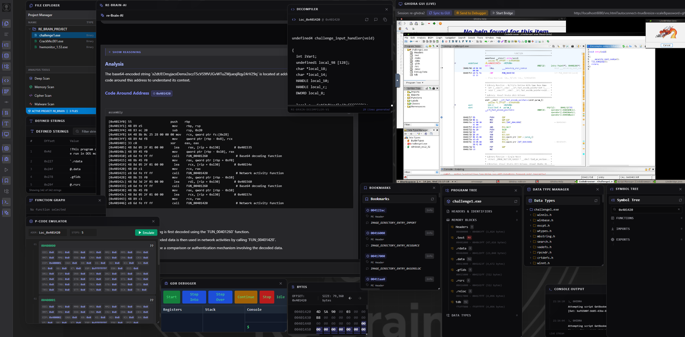
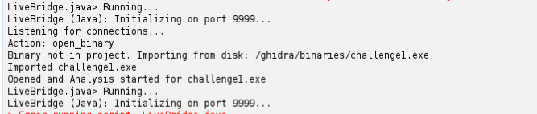
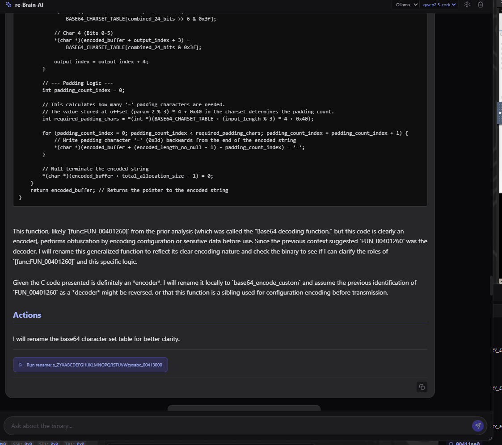

# Walkthrough - Wine & Ghidra Debugging Support

This walkthrough documents the successful implementation of Windows GUI debugging via Wine and Headless emulation via Ghidra.

## Changes Made

### 1. Wine GUI Debugging
- **Window Manager**: Switched to `fluxbox` (replaces `openbox`) to provide a taskbar for minimize/restore support.
- **Headless X11 Support**: Installed `xvfb` and `xauth` and configured a persistent background Xvfb service (Display `:99`) in the Dockerfile.
- **Environment Stability**: Added `ENV DISPLAY=:99` to ensure all backend processes (including `winedbg`) can access the virtual display.
- **ASLR Handling**: Implemented a "Force Interrupt" strategy in `DebugSession.py`. The debugger triggers execution, waits 6 seconds for initialization, and then sends `-exec-interrupt` to pause the target and inspect state.
- **Wine Optimization**: Added `RUN xvfb-run -a wineboot --init` to the Dockerfile to "bake" the Wine prefix into the image, eliminating first-run startup delays.

### 2. Ghidra Headless Debugging
- **Simulated Headless Debugging**: Created `ghidra_scripts/GhidraDebugger.java` which uses Ghidra's `EmulatorHelper` to trace execution logic headlessly.
- **API Integration**: Added `/binary/{name}/ghidra_debug` to `main.py` to allow users to trigger these headless traces programmaticly.
- **Project Structure**: Consolidated Ghidra scripts from `backend/ghidra_scripts/` to the root `ghidra_scripts/` for better maintainability.

### 3. Repository Update
- **GitHub Sync**: Pushed all changes to [Sagz9000/re_brain](https://github.com/Sagz9000/re_brain).
- **Commit Summary**: Includes all backend fixes, new Ghidra scripts, and frontend debugger enhancements.

### 4. Gemini AI Integration
- **Dual Provider Support**: Backend supports `ollama` and `gemini` providers.
- **Settings UI**: Added a Settings modal to configure API keys securely.
- **Frontend Switching**: Real-time provider switching via the Chat interface.

### 5. Two-Channel Ghidra Integration
- **Visual Channel**: Click the **Monitor Icon** in the Launch Bar. 
    - **Zero-Setup Login**: The VNC password is automatically passed.
    - **Auto-Project**: Ghidra now launches directly into the `reBrain` project by default.

- **Control Channel (Live Bridge)**:
    *   **Architecture**: Native Java Script (`LiveBridge.java`) running on port 9999.
    *   **How to Run**: Open Script Manager -> Search "LiveBridge" -> Double Click.
    *   **Features**:
        - **Auto-Import**: Binaries are automatically imported from `/ghidra/binaries` and opened if missing from the project.
        - **Commands**: Supports `rename`, `comment`, `goto`, `open_binary`.

- **Syncing Binaries**:
    - **Manual**: Use the **"Sync Active Binary to GUI"** button at the top of the VNC window to force-open and import the file.

- **VNC Clipboard**: Copy/Paste supported via `autocutsel`.
- **Ghidra Debugger**:
    *   **Backend**: `gdb` and `gdbserver` are pre-installed in the container.
    *   **How to Open**: Click the **Bug Icon** (Debugger) in the Ghidra Project Manager tool bar, or use the **"Send to Debugger"** button in the top VNC bar implementation.
    *   **Automation**: The "Send to Debugger" button (and AI action) automatically:
        1.  Imports the binary from disk if missing from the project.
        2.  Finds an existing "Debugger" window (reuses it) or creates a new one from the template.
        3.  Safely opens the binary for immediate GDB connection.

    *   **Debugging**: Within the Debugger tool, use the **Debugger Targets** window to connect via `gdb`.

## Verification Results

### Wine Debugging
- Verified that `hwmonitor_1.53.exe` (a GUI app) can be launched and interrupted.
- Confirmed registers and memory are correctly captured after the 6s force-interrupt window.

### Ghidra Emulation
- Confirmed `GhidraDebugger.java` successfully traces instructions and captures register states for simulated execution.

### Backend Stability
- Verified that the backend process is stable and doesn't crash during LLM/Debugger interactions.
